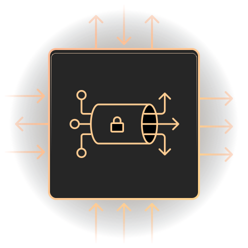

    <h1> Ragnarok </h1>
	
 A .Net wrapper for the <a href="https://ngrok.com/docs#client-api">ngrok Agent Api</a>

	
Expose your localhost to the web

	

 
 
    

### What is [ngrok](https://ngrok.com)?
ngrok is a reverse proxy that creates a secure tunnel from a public endpoint to a locally running web service.
ngrok captures and analyzes all traffic over the tunnel for later inspection and replay.  

### What is the [ngork Agent Api](https://ngrok.com/docs#client-api)? 
The ngrok client exposes an HTTP API that grants programmatic access to:
 * Collect status and metrics information
 * Collect and replay captured requests
 * Start and stop tunnels dynamically     
     
     
 # Project Breakdown
 
 ### [Ragnarok Agent Api](https://github.com/0phois/Ragnarok/tree/master/src/Ragnarok.AgentApi)
 This project acts as a wrapper for the ngrok agent api. All api endpoints are exposed via the [Ragnarok Client](https://github.com/0phois/Ragnarok/blob/master/src/Ragnarok.AgentApi/Client/RagnarokClient.Requests.cs), with convenience methods to `connect` and `disconnect` tunnels provided via [client extensions](https://github.com/0phois/Ragnarok/blob/master/src/Ragnarok.AgentApi/Helpers/Extensions/RagnorokClientExtensions.cs).   
 
 For additional details, refer to the [project readme](https://github.com/0phois/Ragnarok/tree/master/src/Ragnarok.AgentApi) 
 
 ### [Ragnarok Hosted Service](https://github.com/0phois/Ragnarok/tree/master/src/Ragnarok.HostedService)
 This project allows for starting the ngrok client as a [hosted service](https://docs.microsoft.com/en-us/dotnet/api/microsoft.extensions.hosting.ihostedservice?view=dotnet-plat-ext-5.0) within your application. This can be beneficial for establishing a public URL during the development process for testing webhooks for exposing your local site to external stakeholders.  
 
 For additional details, refer to the [project readme](https://github.com/0phois/Ragnarok/tree/master/src/Ragnarok.HostedService)   

* * *

Licensed under the MIT license.  
See the [`LICENSE`](https://github.com/0phois/Ragnarok/blob/master/LICENSE) in the project root for more information.
